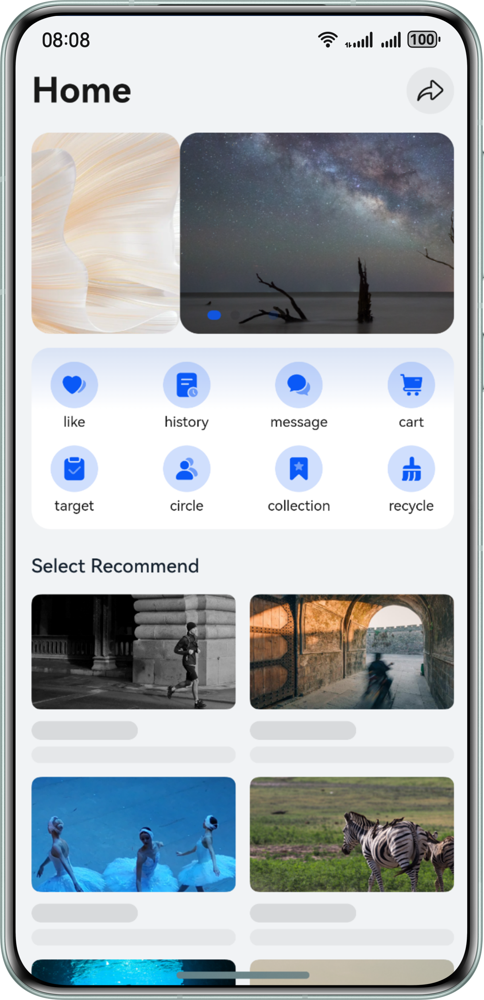

# Web-Based Responsive Layout Development


## Overview
This sample demonstrates how to implement common web effects, such as font size adjustment, image size adjustment, grid layout, carousel layout, and custom dialog box, based on web capabilities for multi-device adaptation, such as relative unit, media query, and window event. Such integrated web capabilities can provide a good user experience on multiple devices.

## Preview

| BreakPoint | sm                                                       | md                                                          | lg                                                        |
|---------|----------------------------------------------------------|-------------------------------------------------------------|-----------------------------------------------------------|
| Final effect        |  |  |  |


## Project Directory

```
├──WebProject                           // Web project
├──entry/src/main/ets/
│  ├──entryability
│  │  └──EntryAbility.ets               // Entry ability
│  ├──entrybackupability  
│  │  └──EntryBackupAbility.ets  
│  └──pages              
│     └──Index.ets                      // Page entry
└──entry/src/main/resources             // Static resources of the application
```

## How to Implement

1. Use media query to set element attributes, such as font size and image size.
2. Dynamically adjust the size of each carousel image and the carousel distance at a time to implement different carousel effects.
3. Use media query to set different numbers of columns and spacing at different breakpoints to implement different grid effects.
4. Use media query to set different size of dialog boxes at different breakpoints.

## Permissions

N/A

## Constraints
1. The sample is only supported on Huawei phones with standard systems.
2. The HarmonyOS version must be HarmonyOS 5.0.5 Release or later.
3. The DevEco Studio version must be DevEco Studio 5.0.5 Release or later.
4. The HarmonyOS SDK version must be HarmonyOS 5.0.5 Release SDK or later.
