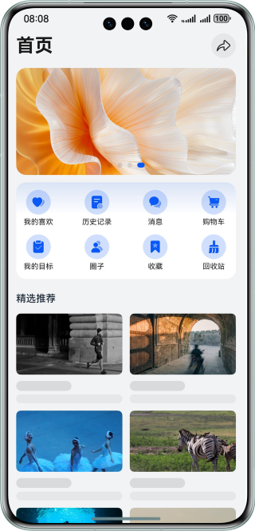
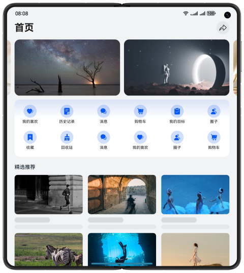
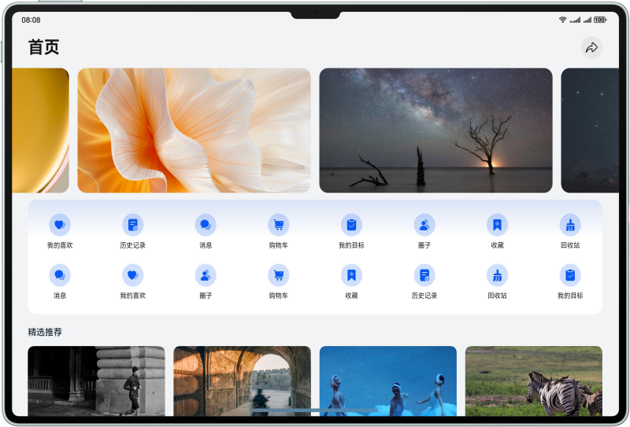

# 基于Web响应式能力实现一多布局


### 简介
本示例基于Web侧提供的一多能力，如相对单位、媒体查询、添加窗口事件等，实现了常见的Web的一多效果，包括：字体大小调整、图片大小调整、宫格布局、轮播布局、自定义弹窗。通过集成Web一多的相关能力，可以让应用在多设备上都有良好的用户体验。

### 效果预览

| 断点   | sm                                   | md                                      | lg                                    |
| ------ | ------------------------------------ | --------------------------------------- | ------------------------------------- |
| 效果图 |  |  |  |


### 工程目录

```
├──WebProject                           // Web程序位置
├──entry/src/main/ets/
│  ├──entryability
│  │  └──EntryAbility.ets               // 程序入口类
│  ├──entrybackupability  
│  │  └──EntryBackupAbility.ets  
│  └──pages              
│     └──Index.ets                      // 程序页面入口
└──entry/src/main/resources             // 应用静态资源目录
```

### 具体实现
1. 字体大小与图片大小都依靠媒体查询，通过媒体查询来动态设置元素的相关属性，实现一多效果。
2. 轮播图一多主要依靠动态调整每个轮播项的尺寸以及单次轮播距离实现不同尺寸下不同的轮播效果。
3. 宫格部分主要依靠媒体查询在不同屏幕断点尺寸下，设置不同的列数与间距，从而实现一多效果。
4. 自定义弹窗主要依靠媒体查询，在不同断点下设置不同的弹窗尺寸。

### 相关权限

不涉及

### 约束与限制
1. 本示例仅支持标准系统上运行，支持设备：华为手机。

2. HarmonyOS系统：HarmonyOS 5.0.5 Release及以上。

3. DevEco Studio版本：DevEco Studio 5.0.5 Release及以上。

4. HarmonyOS SDK版本：HarmonyOS 5.0.5 Release SDK及以上。